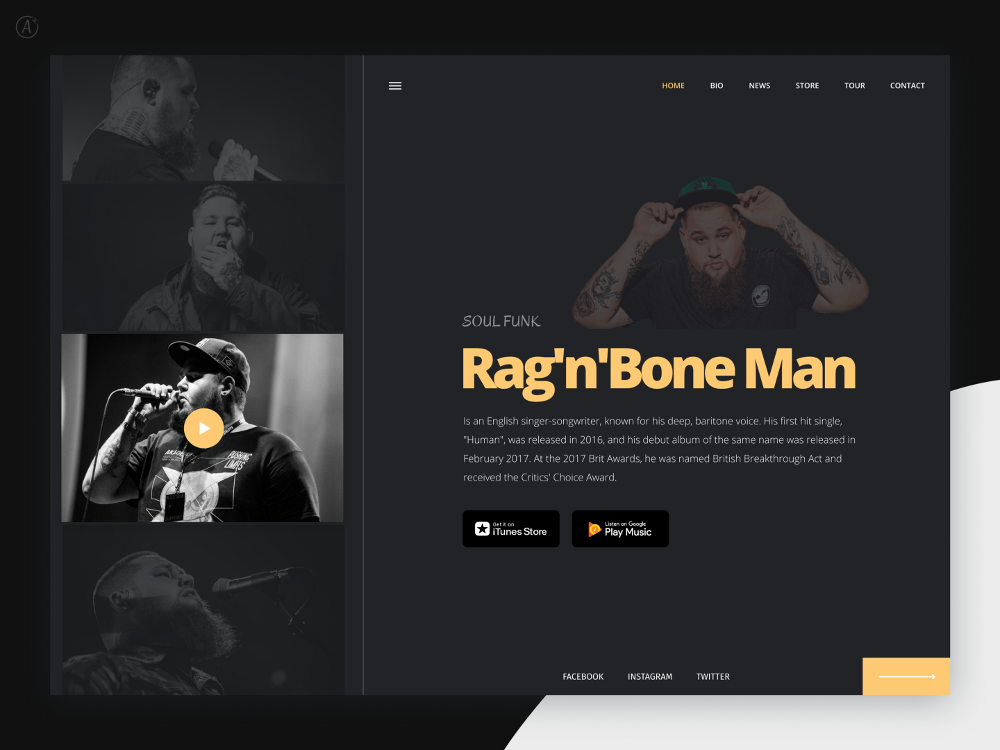

# Mini curso de HTML, CSS e JavaScript para iniciantes

Se você esta procurando um curso que te ajude a entender o **HTML**, **CSS** e **JavaScript** de uma forma feliz e simples, sem termos técnicos que só te deixam com mais dúvidas, esse é o seu curso.

O conteúdo desse curso têm quatro formatos:

- Posts, e esse é o post que será o seu índice.
- eBook que você pedir o seu no link a seguir: http://linkdoebook.com
- Audio book que você pode acessar no link a seguir: http://linkaudiobook.com
- Vídeos aulas que você pode acessar nesse link: https://collabcode.training/course/free/html-css-javascript

Um fato importante sobre as vídeos aulas, elas foram feitas ao vivo pela [twitch.tv/marcobrunobr](https://twitch.tv/marcobrunobr). Toda segunda semana do mês tem um mini curso novo, ao vivo e free, fica o convite para você aparecer algum dia entre 19:32 e 22:32. Você pode acessar a agenda dos cursos ao vivo no link a seguir: https://collabcode.training/twitch/marcobrunobr

## Projeto do curso
O layout que faremos, foi criado por [Aleksandr Malyavka](https://twitter.com/alexmalyavka):

Layout desenvolvido usando o figma, uma ferramenta que funciona no navegador e com a versão free você consegue acessar o layout com o link a seguir: [https://www.figma.com/file/5c1eQvWyOrLamonCjGSHOH/RagNBoneMan?node-id=0%3A4](https://www.figma.com/file/5c1eQvWyOrLamonCjGSHOH/RagNBoneMan?node-id=0%3A4)

## Método de ensino CollabCode

Cada aula tem duração entre 40 minutos e 1 hora de conteúdo em vídeo (dividido em vídeos de 5 a 20 minutos). Ao vivo pela [twitch.tv/marcobrunobr](twitch.tv/marcobrunobr) ficamos o dobro do tempo porque lá, temos pequenas pausas (10 a 15 minutos) após uma explicação para os exercícios e dúvidas.

### Exercício
É dividido em duas partes. Primeira parte chamo de *Issue* (questão), nela não mostro o passo a passo do código, só terá uma solicitação do que deve ser feito, aqui o objetivo é você validar se entendeu o que acabei de explicar.

A segunda é um passo a passo com todo código, ela tem dois objetivos: 
- caso esteja travado poder ter um lugar para consultar como pode ser feito;
- depois de concluir o exercício, consultar uma das formas de resolver.

> CUIDADO! Não existe só uma solução (código) para uma **issue** e a sua solução poderá ser melhor que a minha! 😆

### Desafios
 No final de cada aula, passo 3 desafios para você realizar em um grupo de estudo ou sozinho, chamo de **Desafios top top top** (básico, intermediário e avançado), faça cada um deles, aqui é o momento mais importante da aula, onde você validará diariamente como está indo a evolução do seu conhecimento. 
 
 Só vá para a próxima aula se conseguir resolver o desafio básico, mas sem dúvida terá mais evolução se conseguir resolver até o avançado.

#### Desafio básico
Peço algo pequeno e com algo que tenha explicado na aula. Ele será o primeiro passo para você sentir confiança para os demais desafios.

#### Desafio intermediário
Tem dois modelos. Primeiro é algo que pedi na aula, mas em outro contexto. 

Segundo, quando estivermos na aula 2 para frente, pedirei algo que precisará do conhecimento de uma ou mais aulas anteriores.

#### Desafio avançado
Posso dar dicas ou não, mas vou pedir algo que não expliquei e terá que se virar para aprender. Essa será a sua vida real, trabalhando como pessoa desenvolvedora, você terá muitos problemas que será necessário estudar, aprender e aplicar a solução.

## Como criar um grupo de estudos?
Eu não me responsabilizo pelas amizades que você faz na comunidade CollabCode, mas caso tenho qualquer problema com uma pessoa, por favor fique à vontade para me mandar um email em **gueio@collabcode.tech**

Temos um [código de conduta](https://github.com/CollabCodeTech/code-of-conduct/blob/master/pt-BR.md) e ele deve ser respeitado, sempre visite o link porque ele também tem atualizações.

Para criar o seu grupo de estudo ou achar um temos 2 canais para os participantes da comunidade trocarem uma ideia:

- [Discord](https://discord.gg/YeeEAYj)
- [Telegram](https://t.me/joinchat/BC29Kg9W_uNw8KEI-McrJQ)

## Como tirar dúvidas?
Tire suas dúvidas pelos 2 canais da comunidade CollabCode:

- [Discord](https://discord.gg/YeeEAYj)
- [Telegram](https://t.me/joinchat/BC29Kg9W_uNw8KEI-McrJQ)